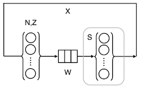
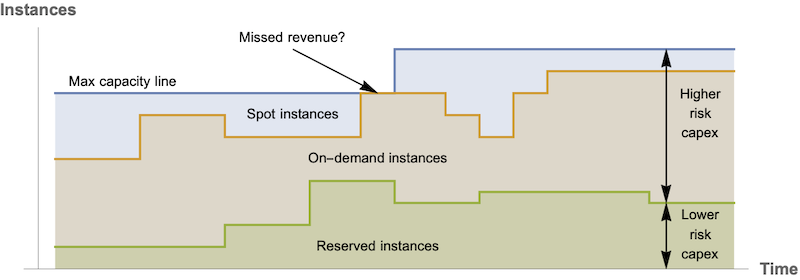

# Hit the road Jack, it ain't about performance no more


Performance Calendar articles are mostly about improving web performance. 
That's good because I don't know much about the web: it's very complicated. 
So, I'm going to talk about something much more transparent: cloud performance. 
In that sense, my title should read: *It Ain't About Performance No More...* **in The Cloud**.

Moreover, I'm going to discuss cloud performance using just two figures, viz., 
application throughput and application latency in the cloud. 
Everybody loves to talk about those two metrics so, that should make things easy.


## Tomcat on AWS
The context is a mobile application running on top of a Tomcat thread-server that also 
communicates with other third-party web services, e.g., hotel and car-rental reservation systems. 
A variable number of application instances are active during each 24 hour business cycle, depending 
on the user traffic. The elastic capacity requirements are handled by Amazon Web Services (AWS). 

The AWS cloud configuration can be summarized as:

  * Elastic load balancer (ELB)
  * AWS Elastic Cluster (EC2) instance type `m4.10xlarge` with 20 CPUs or 40 VPUs 
  * Auto Scaling group (A/S)
  * Mobile users make requests to Apache HTTP server (versions 2.2 and 2.4) via ELB on EC2
  * Tomcat thread server (versions 7 and 8) on EC2 makes calls to 3rd-party web services
  * A/S controls the number of active EC2 instances based on incoming ELB traffic and configured A/S policies
  * ELB balances incoming traffic across all active EC2 nodes in the AWS cluster

All the subsequent performance data discussed here are taken from this is a production environment. 


## Performance Profiles

Performance data was collected from the above **production** system using a combination
 of the following FOSS tools:

  * JMX (Java Management Extensions) data from JVM
  * jmxterm
  * VisualVM
  * Java Mission Control Datadog dd-agent
  * Datadog — also integrates with AWS CloudWatch metrics 
  * Collectd — Linux performance data collection
  * Graphite and statsd — application metrics collection & storage 
  * Grafana — time-series data plotting
  * Custom data collection scripts
  * R statistical libraries and the RStudio IDE
  * PDQ queueing analyzer tool 

More details about the data collection procedures can be found in References 1 and 2 below. 

PDQ (Pretty Damn Quick) is software tool, written by the author, comprising a 
[library of functions](http://www.perfdynamics.com/Tools/PDQman.html)
for solving queue-theoretic performance models. 
An explicit example will be presented shortly. 


### Throughput profile

First, let's consider the application throughput profile shown in Figure 1. 
The most important thing to note about this plot of throughput is that it is **not** a time 
series&mdash;that every performance monitoring tool spits out. 

As general matter, time are rather useless for doing deeper performance analysis. 
Just because a monitoring tool produces time-series plots, doesn't make them particularly useful. 
It's just an obvious and straightforward thing for them to do. 
Instead, Figure 1 shows the steady-state view of the throughput, X(N), as a nonlinear function of 
the mobile user request load, N. In other words, N is the independent variable and X(N) is the 
dependent variable. All steady-state throughput profiles are *concave* functions. 
Since each user-request is assigned to a Tomcat thread, we can label N as "users" or 
"requests" or "threads". They're all logically equivalent. 

  
<figcaption><b>Figure 1: Throughput profile of Tomcat application on AWS</b><p></figcaption>


Figure 1 is quite busy. 
The dots are the measured throughput, X, at the corresponding number of measured threads, N. 
Each dot corresponds to a particular 
timestamp when the data was sampled but, that information has becomes *implicit* rather than 
explicit in Figure 1. 
The data points range approximately between N = 100 user-threads and N = 500 threads. 
On reflection, it should be clear that the lower values of N 
correspond to the quiescent period during the 24 hour window and conversely, 
the higher values of N correspond to the heaviest daily traffic. 

What is not apparent from a simple scatterplot of those data is that they tend to fall along 
two line segments:
  1. the diagonal red dashed line (up to N = 300)
  1. the horizontal red dashed line (beyond N = 300)

The knee in the data is indicated by the blue arrow. 

The red lines represent the *statistical mean* of the measured data&mdash;in the sense 
of linear regression analysis.  The variation in the data corresponds to statistical fluctuations
(or "noise") about the mean. 

Moreover, these red dashed line have a particular meaning in queueing theory&mdash;you do 
know you're queuing theory don't you? (elsewise, see Ref. 4) 
The diagonal line represents the ideal **parallel** performance bound. In other words, you cannot 
have a throughput better than that as you increase the request load; on average. 
Similarly, the horizontal line represents the ideal **saturation** performance bound. 
You cannot have a throughput that exceeds that bound; on average. 
A more typical average throughput profile is represented by the blue dotted curve, i.e., 
well below the bounds.  In that case, a lot more queueing is present. 
As the AWS data shows, you can have *instantaneous* values that exceed these bounds but 
they only transient. 

In case you're wondering, yes, Figure 1 only shows measurements from one EC2 instance 
in the AWS cluster. 
For the standpoint of PDQ, that's the correct approach. All the instances are supposed to scale 
identically. That's the job of the ECB load balancer and that's the assumption of PDQ. 
If instances are not scaling identically, that's not the fault of queueing theory, that's the 
fault of the load balancer configuration of some other effect in the infrastructure.  


### PDQ Model

The white squares in Figure 1 (i.e., the calculated throughput X(N)) 
come from the queueing representation shown schematically in Figure 2. 

Reading from left to right, the little bubbles in curly braces represent N user-threads and 
their associated think time, Z. For technical reasons, we set Z = 0 in this Tomcat model. 
User requests flow rightward to a waiting line (the little boxes) labelled, W. 
There, the requests wait to have their work performed by active Tomcat threads, shown in the 
second set of curly braces. 
The average service time of an active threads is 444 milliseconds (derived from the collected 
data on the EC2 instance). 
It turns out that there can only be up to 300 active threads in the AWS set up. 
More on this, later. 


 
<figcaption><b>Figure 2: Queueing representation of AWS-Tomcat</b><p></figcaption>


Figure 2 can be expressed in PDQ, using the R language, as follows. 
First, we assign some global vectors, such as the number of user requests, the number of 
active threads, their service time, and so on. 

```R
requests <- seq(50, 500, 50) # from mobile users
threads  <- 300   # max threads under AWS auto scale policy
stime    <- 0.444 # measured service time in seconds
ztime    <- 0.0   # measured think time in seconds
xx       <- NULL  # x-axis load points 
yx       <- NULL  # corresponding throughput 
```

Then, we define the AWS-Tomcat instance model using PDQ library functions.

```R
library(pdq)

aws.model <- function(nindex) {
  pdq::Init("")  
  pdq::CreateClosed("Requests", BATCH, requests[nindex], ztime)
  pdq::CreateMultiNode(threads, "Threads", MSC, FCFS) 
  pdq::SetDemand("Threads", "Requests", stime) 
  pdq::SetWUnit("Reqs")
  pdq::Solve(EXACT)
  xx[nindex] <<- requests[nindex] # update global vector
  yx[nindex] <<- pdq::GetThruput(BATCH, "Requests")
}
```

The throughput is then calculated for each load value, N, of interest. 
This part of the PDQ model can simply be written as a loop. 

```R
for (i in 1:length(requests)) {
  aws.model(i)
}
```

Finally, we plot the throughput values, X(N), i.e., the white squares in Figure 1.
```R
plot(xx, yx, type="p", pch=0, 
     xlim=c(0,500), ylim=c(0,800), 
     xlab="Threads, N", ylab="Request rate, X(N)"
)
```

That's all it takes. A slight variation in the PDQ code can be used to calculate the 
corresponding response times in Figure 3.

The point of constructing the PDQ model is to see 

  * how the data compares with the model 
  * if there are opportunities for performance improvement 

The hint from Figure 1 is that there does not seem to be much. 
The initial throughput increases linearly with load and runs along the parallel bound. 
You can't beat that. 
It might be possible to lift the saturation bound in some way but, I'll come back to that shorty. 
The only other improvement might be to reduce the variability in the data. 

I note in passing that I've 
seen throughput data for a completely different Tomcat application that was not 
running in any cloud and it did not appear to scale as well is Figure 1. 
Perhaps it was closer to the dotted curve. 
Since I wasn't involved in any way, 
I don't know if that was an anomaly due to bad measurements or bad configuration or some other 
latent effects. 


### Latency profile

Next, let's look at the corresponding response time profile. Roughly speaking, it is the 
inverse function of the throughput: a convex function. 

 
<figcaption><b>Figure 3: Latency profile of Tomcat application  on AWS</b><p></figcaption>

Figure 3 shows the steady-state view of the response time, R(N), as a nonlinear function of 
the mobile user request load, N. Here, R(N) is the 
dependent variable. All steady-state response time profiles are *convex* functions. 

In the parallel throughput region of Figure 1, all the threads are executing independently 
of one another and therefore the the latency remains constant, on average. 
To performance analysts, that horizontal bound is referred to as the "foot" of the "hockey stick" 
profile. In terms of queueing, there isn't any. 

Conversely, the horizontal saturation limit in Figure 1, means the system can't do any more 
work than it was doing at N = 300 threads. Any additional threads do not contribute to the 
throughput. On the other hand, the additional requesting threads do get to wait in queues. 
Those growing queues are reflected in the increasing diagonal line of Figure 3&mdash;the 
so-called hockey stick "handle". 


## The Punchline

Now you can see the meaning of my title. It's not about performance in most cases because 
scaling is taken care of automagically&mdash;more or less. Nobody was more surprised by this 
result than me. This Tomcat application is scaling maximally. The throttling at N = 300 threads 
is a consequence of the Auto Scaling policy that CPU busy not exceed 75% on any EC2 instance. 

So, what is it all about? It's about cost or, more formally, capacity planning. 
It's all about ROI, where there's only minimal ROI to be had by applying 
standard performance tuning exploits.

  
 
<figcaption><b>Figure 4: AWS capacity lines</b><p></figcaption>

In the cloud, one really needs thoroughly understand how Amazon 
charges for capacity. That involves understanding the cost differentials for 
reserved instances, demand instances, spot instances and more recently, lambdas microservices. 
(see Figure 4) 
The same goes for Google or Microsoft cloud services.

As any MBA will attest, it's not really possible to understand cost-benefit analysis without 
combining measurement with models. In this case, capacity models like the PDQ model described here. 


>(Like I said at the beginning of this piece: simple!) <- need a parting remark here.
>Also, explain A/S pseudo saturation. 


  
## References
  1. [Tomcat-Applikationsperformance in der Amazon-Cloud unter Linux modelliert](https://www.linux-magazin.de/ausgaben/2019/02/aws-performance/) (Linux Magazin 2019 in German)
  1. [Linux-Tomcat Application Performance on Amazon AWS](https://arxiv.org/abs/1811.12341) (2019 in English)
  1. [How to Scale in the Cloud: Chargeback is Back, Baby!](https://speakerdeck.com/drqz/how-to-scale-in-the-cloud-chargeback-is-back-baby) (2019 Rocky Mountain CMG slides)
  1. [PDQ: Pretty Damn Quick Performance Analyzer](http://www.perfdynamics.com/Tools/PDQ.html)
  1. [PDQ Version 7 Download](http://www.perfdynamics.com/Tools/PDQcode.html)
  1. [PDQW Tutorial Workshop](http://www.perfdynamics.com/Classes/Outlines/pdqw.html)


